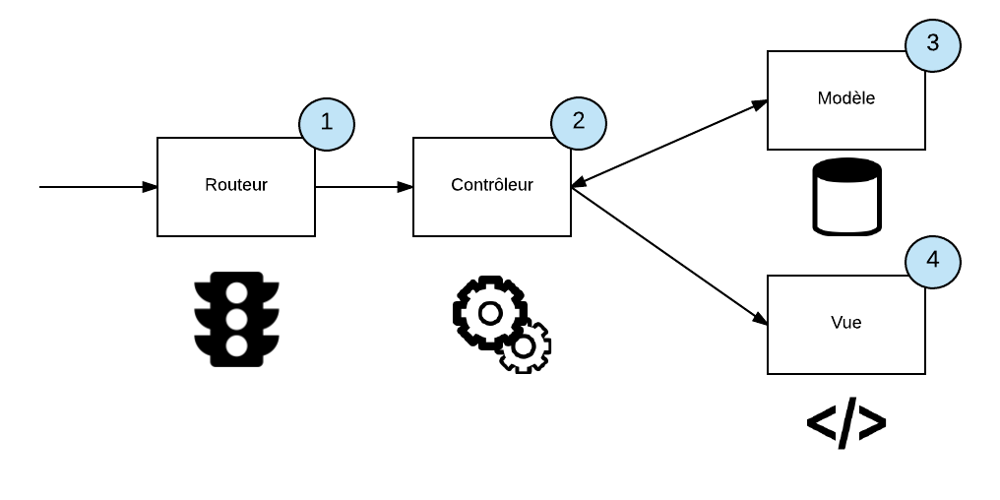

<h1>MVC Architecture Based PHP Framework.</h1>

It can be considered a small framework for those who want to have regular code but do not use large frameworks.

<h2>Routes</h2>

Routes are in rote/Route.php, and you can define all possible url in your website.

<ul>
<li>Route::get('/', "HomeController@index"); # a possible url by GET Request, This url, executes index function in the HomeController.</li>
<li>Route::post('/', "HomeController@index"); # it's like above url, but by POST Request</li>
<li>Route::get('/core/{id}', "HomeController@index", ["middlewares" => 'SampleMiddleware']); # id is a varible and And is available inside the index function. also, you can execute a Middleware for this rote. </li>
</ul>

<h2>Controller</h2>

controllers are in App/Cotrollers. each controller has many function that execute when a Route call them. 
Some of the most commonly used functions in controls are shown below.

<ul>
<li>Request::GET()->all();</li>
<li>Request::POST()->all();</li>
<li>Request::GET()->find('parameter_name');</li>
<li>Request::POST()->find('parameter_name');</li>
<li>return self::view('view file names in the View folder (without bload.php)', $data);</li>
</ul>
<h2>Views</h2>

Views include files in the example_name.blade.php format that are located at App/views. Views are called in the controls and the sent array is accessible to them.

<h2>Middleware</h2>

Middleware helps control access to different parts of the site. Middleware is located at App / Middlewares. An arbitrary middleware can be defined to run before or after preparing a response.

<h2>Static Files</h2>

All static files are in the public address.
